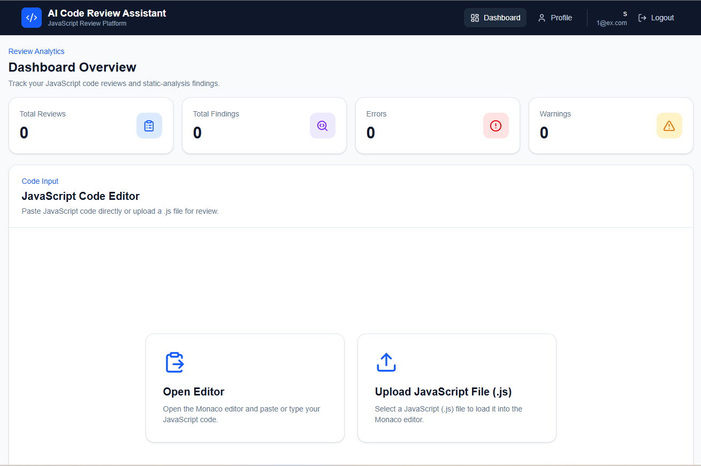

# AI Code Review Assistant

AI Code Review Assistant is a full-stack web application that analyzes JavaScript code using static analysis and AI-assisted review.

The application helps developers identify code issues, understand warnings, receive improvement suggestions, generate improved code, manage previous reviews, view review analytics, and export review results.

## Features

### Authentication and Account Management

- User registration and login
- JWT-based authentication
- Protected routes
- Forgot password and reset password flow
- View user profile
- Edit profile information
- Change password
- Logout

### JavaScript Code Review

- Write or paste JavaScript code using an integrated code editor
- Upload `.js` files for review
- Static code analysis
- Error and warning detection
- Rule information and issue locations
- AI-assisted explanations
- AI-generated suggestions
- Improved JavaScript code generation

### Review Management

- Automatically save code reviews
- View review history
- Open previous reviews
- Delete reviews
- User-specific review data

### Dashboard Analytics

The dashboard displays:

- Total Reviews
- Total Findings
- Total Errors
- Total Warnings

Statistics automatically refresh when reviews are created or deleted.

### Export Features

- Copy improved code to clipboard
- Download improved code as a `.js` file
- Generate PDF review reports

PDF reports include:

- Static analysis summary
- Static analysis findings
- AI overview
- AI issues and explanations
- AI suggestions
- Improved code
- Generation timestamp
- Multi-page support
- Page numbers

## Tech Stack

### Frontend

- React
- Vite
- JavaScript
- Tailwind CSS
- Axios
- React Router
- React Hot Toast
- Lucide React
- jsPDF

### Backend

- Node.js
- Express.js
- PostgreSQL
- JWT Authentication
- bcrypt
- ESLint-based static analysis
- Gemini API

## Application Architecture

```text
React Frontend
      |
      | HTTP / REST API
      v
Express Backend
      |
      |----------------------|
      |                      |
      v                      v
PostgreSQL              Review Services
Database                     |
                             |--------------------|
                             |                    |
                             v                    v
                     Static Analysis        Gemini AI Review
```

## Project Structure

```text
ai-code-review-assistant/
|
|-- backend/
|   |-- config/
|   |   `-- db.js
|   |
|   |-- controllers/
|   |   |-- authController.js
|   |   `-- reviewController.js
|   |
|   |-- middleware/
|   |   `-- authMiddleware.js
|   |
|   |-- models/
|   |   |-- reviewModel.js
|   |   `-- userModel.js
|   |
|   |-- routes/
|   |   |-- authRoutes.js
|   |   |-- healthRoutes.js
|   |   `-- reviewRoutes.js
|   |
|   |-- services/
|   |   |-- aiReviewService.js
|   |   `-- staticAnalysisService.js
|   |
|   |-- server.js
|   `-- package.json
|
|-- frontend/
|   |-- public/
|   |
|   |-- src/
|   |   |-- components/
|   |   |-- context/
|   |   |-- pages/
|   |   |-- services/
|   |   |-- styles/
|   |   `-- utils/
|   |
|   |-- index.html
|   |-- vite.config.js
|   `-- package.json
|
`-- README.md
```

## Getting Started

### Prerequisites

Install the following software before running the project:

- Node.js
- npm
- PostgreSQL
- Git

A Gemini API key is required to use the AI-assisted review feature.

## Clone the Repository

```bash
git clone https://github.com/siva998152/ai-code-review-assistant.git

cd ai-code-review-assistant
```

## Backend Setup

Open the backend directory:

```bash
cd backend
```

Install dependencies:

```bash
npm install
```

Create a `.env` file inside the `backend` directory.

Example:

```env
PORT=5000

DB_HOST=localhost
DB_PORT=5432
DB_USER=your_postgresql_username
DB_PASSWORD=your_postgresql_password
DB_NAME=your_database_name

JWT_SECRET=your_secure_jwt_secret

GEMINI_API_KEY=your_gemini_api_key
```

Do not commit the `.env` file or expose real credentials.

Start the backend server using the script configured in `backend/package.json`.

For example:

```bash
npm run dev
```

The backend runs locally at:

```text
http://localhost:5000
```

## Frontend Setup

Open another terminal from the project root:

```bash
cd frontend
```

Install dependencies:

```bash
npm install
```

Start the Vite development server:

```bash
npm run dev
```

Open the local URL displayed by Vite in your browser.

## API Overview

### Authentication Routes

```text
POST   /api/auth/register
POST   /api/auth/login
POST   /api/auth/forgot-password
POST   /api/auth/reset-password
GET    /api/auth/profile
PUT    /api/auth/profile
PUT    /api/auth/change-password
```

### Review Routes

```text
POST   /api/reviews/analyze
GET    /api/reviews
GET    /api/reviews/stats
GET    /api/reviews/:id
DELETE /api/reviews/:id
```

Protected endpoints require a JWT access token.

Example authorization header:

```text
Authorization: Bearer <token>
```

## Review Workflow

```text
User submits JavaScript code
            |
            v
JWT authentication
            |
            v
Static analysis
            |
            v
Gemini AI review
            |
            v
Review saved to PostgreSQL
            |
            v
Results displayed in dashboard
            |
            |----------------------|
            |                      |
            v                      v
Review History               Export Results
                             PDF / JS / Clipboard
```

## Security Practices

The application uses:

- Password hashing with bcrypt
- JWT authentication
- Protected API routes
- User-specific review queries
- Environment variables for credentials and API keys
- Server-side validation
- Password verification before password changes

Sensitive environment files such as `.env` are excluded from Git.

## Known Limitations

- The application currently analyzes JavaScript only.
- AI-assisted reviews depend on Gemini API availability.
- Gemini API quota limits or periods of high demand can temporarily prevent AI review generation.
- Local development URLs are currently configured in frontend API service files and must be replaced with deployment environment variables before production deployment.
- The forgot-password implementation currently verifies the account and issues a short-lived reset token through the API; production email delivery is not yet implemented.

## Future Improvements

- Support additional programming languages
- Email-based password reset delivery
- OAuth authentication
- Code syntax highlighting in generated PDF reports
- Configurable ESLint rules
- Review search, filtering, and pagination
- Dashboard charts and trends
- AI review retry and provider fallback strategies
- Automated testing
- Docker support
- CI/CD pipeline

## Screenshots

Screenshots of the authentication pages, dashboard, code analysis results, AI review results, review history, PDF report, and profile page can be added here.

Example:

```markdown
### Dashboard


```

## Author

**V Siva Mallesh**

- GitHub: `siva998152`
- Computer Science and Engineering Student
- Full-Stack and Cloud Development Enthusiast

## Project Status

The main application features are implemented and working locally.

Current remaining work:

- Add project screenshots to the repository
- Configure production environment variables
- Deploy PostgreSQL database
- Deploy backend
- Deploy frontend
- Perform final production testing

## License

No license has been added to this repository yet.